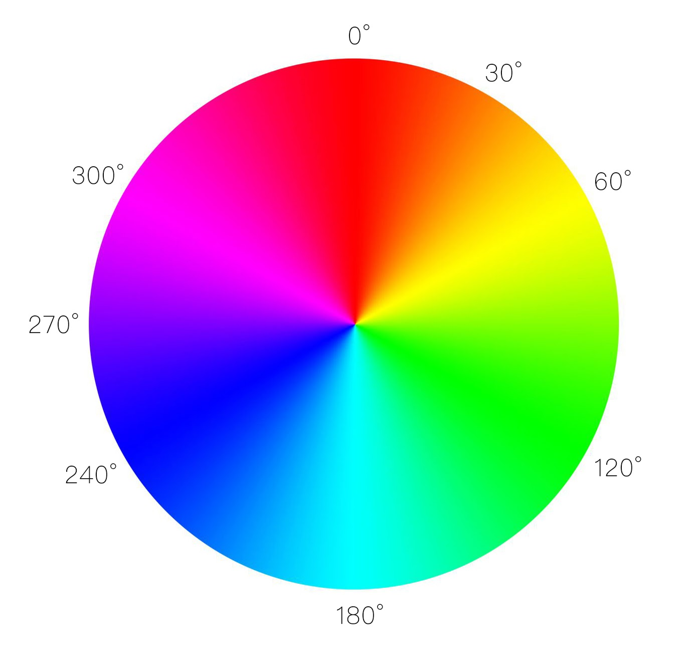

# 08 - Fun with HTML5 Canvas

重點：
- 狀態切換
    先行設定一個布林值的變數，利用於 function 內切換此變數的布林值，讓此 function 可以執行，或者 return。
    常用於loading effect。

- Cavas 指令操作
    - `getContext()` - 透過此方法可以取得渲染環境及其繪圖函數(function)
        1. `2d`
        1. `webgl`
        1. `webgl2`
        1. `bitmaprenderer`
    - `lineCap` - Canvas 2D API 指定如何繪製每一條線段末端的屬性。
        1. `butt`(default) - 線段末端以方形結束。
        1. `round` - 線段末端以圓形結束。
        1. `square` - 線段末端以方形結束，但是增加了一個寬度和線段相同，高度是線段厚度一半的矩形區域。
    - `strokeStyle` - Canvas 2D API 描述畫筆（繪製圖形）顏色或者樣式的屬性。
        1. `color` - 字符串，可以轉換成 CSS `<color>` 值。
        1. `gradient` - CanvasGradient 對象（線性漸變或放射性漸變）。
        1. `pattern` - CanvasPattern 對象（可重複的圖片）。
    - `lineJoin` - Canvas 2D API 用來設置2個長度不為0的相連部分如何連接在一起的屬性（長度為0的變形部分，其指定的末端和控制點在同一位置，會被忽略）。
        1. `round`
        1. `bevel`
        1. `miter`
    - `lineWidth` - Canvas 2D API 設置線段厚度的屬性（即線段的寬度）。
    - `beginPath()` - Canvas 2D API 通過清空子路徑列表開始一個新路徑的方法。
    - `moveTo()` - Canvas 2D API 將一個新的子路徑的起始點移動到(x，y)坐標的方法。
    - `lineTo()` - Canvas 2D API 使用直線連接子路徑的終點到x，y坐標的方法（並不會真正地繪製）。

- 色環 HSL `hsl(Hue, Saturation, Lightness)`
    > HSL為Hue（色相）、Saturation（飽和度）、 Lightness（明度）的縮寫。
    - Hue （色相）0 ~ 360：色彩的基本屬性，在HSL中以0度為紅色、60度為黃色、120度為綠色、180度為青色、240度為藍色、300度為洋紅色。
    
    - Saturation （飽和度） 0% ~ 100% ：色彩的純度，越高色彩越純，越低色彩越灰。
    - Lightness （明度） 0% ~ 100% ：色彩的亮度，越高色彩越白，越低色彩越黑。

- 執行不同的判斷式
    ```
    let lineWidth = 1, direction = false;
    if (lineWidth >= 50 || lineWidth <= 1 ) {
      direction = !direction
    }
    lineWidth = direction ? lineWidth + 1 : lineWidth - 1;
    ```
    1. 設定兩個判斷式。
    1. 第一個判斷式當 `lineWidth >= 50` or `lineWidth <= 1`，判斷式內的 direction 變數會反轉(Inverted)。
    1. 第二個判斷式判斷 direction 為 true 執行 `lineWidth + 1` ，反之執行 `lineWidth - 1`。