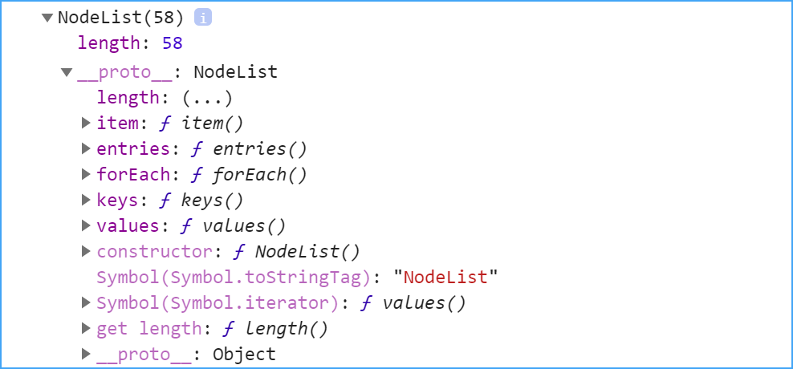

# 18 - Adding Up Times with Reduce

重點:
- `document.querySelectorAll('selector')` 選取出來的為 NodeList 的類陣列，預設只有 `forEach` & `length` 等少數方法。
    
    轉換惟一般陣列有以下四種方式
    - `[...Nodelist].map(item => item)` - ES6 的展開
    - `Array.from(NodeList).map(item => item)` - 直接轉換成陣列
    - `[].map.call(NodeList, item => item)` - call 方法並將參數傳入
    - `[].map.apply(NodeList, [item => item])` - apply 方法並將參數傳入，參數須為陣列

- `Array.reduce((perv, next) => perv + next, initialValue )` - 對陣列中的每一個元素，由左至右傳入指定的函數，最後返回一個累加 (accumulator) 的值。
    - `perv` 表示目前的累加值，一開始的預設值是 `initialValue`
    - `next` 表示目前執行到的元素值
    - `initialValue` 一開始要傳入的預設值，預設值不傳 ，是抓陣列第一個值，當預設值。

- 時間計算
    - 小時：`hours = totalSeconds / 3600`
        > 所有秒數 / 3600 即為時數
    - 分鐘：`mins = (totalSeconds - hours * 3600) / 60`
        > 所有秒數 / 3600 的餘數再 / 60 所得即為分鐘數
    - 秒： `secs = totalSeconds % 60`
        > 所有秒數對 60 取餘數 即為秒數
        ```js
        function clacTime (time) {
            let totalSeconds = time
            const hours = Math.floor(totalSeconds / 3600)
            totalSeconds = totalSeconds % 3600
            const mins = Math.floor(totalSeconds / 60)
            totalSeconds = totalSeconds % 60
            if (hours === 0 && mins === 0) {
                return `${totalSeconds}s`
            } else if (hours === 0 && mins > 0) {
                return `${mins}m:${totalSeconds}s`
            } else {
                return `${hours}h:${mins}m:${totalSeconds}s`
            }
        }
        ```


[DEMO](https://gn00678465.github.io/JavaScript_30_exercise/18%20-%20Adding%20Up%20Times%20with%20Reduce/index-EXERCISE.html)