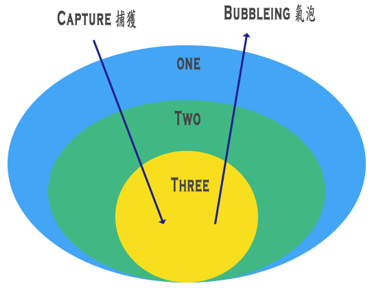
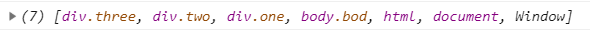

# 25 - Event Capture, Propagation, Bubbling and Once

- `addEventListener('event', callback, option)` - [MDN](https://developer.mozilla.org/zh-CN/docs/Web/API/EventTarget/addEventListener)
  > 將指定的監聽器註冊到 EventTarget 上，當該對象觸發指定的事件時，指定的 callback function 就會被執行。
    ```js
    document.querySelector('').addEventListener('event', function(e){
      console.log(e)
    }, { Capture: false, Once: false })
    ```
    有3個參數，分別為
    1. event `String` : 偵聽的事件類型
    1. callback `Function` : 回呼函式
    1. option `Boolean` : `{ capture: true || false, once: true || false }`
        - `capture: true` 捕獲 (capturing) : 事件由外層往內層傳播到該 `EventTarget` 時觸發。
        - `capture: false` 冒泡 (bubbling) : 事件由內層往外層傳播到該 `EventTarget` 時觸發。
        
        1. `once` : 此事件只執行一次。
        1. `e.stopPropagation()` : 可阻止當前事件繼續進行捕獲(capturing)及冒泡(bubbling)階段的傳遞。
        1. `event.composedPath()` : 回傳一個 `EventTarget` 陣列，當該偵聽器調用時回傳事件路徑。
            > 捕獲(capturing)及冒泡(bubbling) 無差異。
            
        1. `e.preventDefault()`　:　取消事件的預設行為。
        1. `event binding` (事件綁定) : 將事件綁定到 `EventTarget` 上，當此事件被觸發時變執行 function。
        1. `event delegate` (事件委派) : 
        1. `e.target` || `e.currentTarget`
          - `e.target` : 代表的是註冊事件物件
          - `e.currentTarget` : 代表的是實際觸發事件的物件


```JS
<a herf="#"></a>                // # 代表錨點
<a herf="javascript:;"></a>     // 空連結
```
